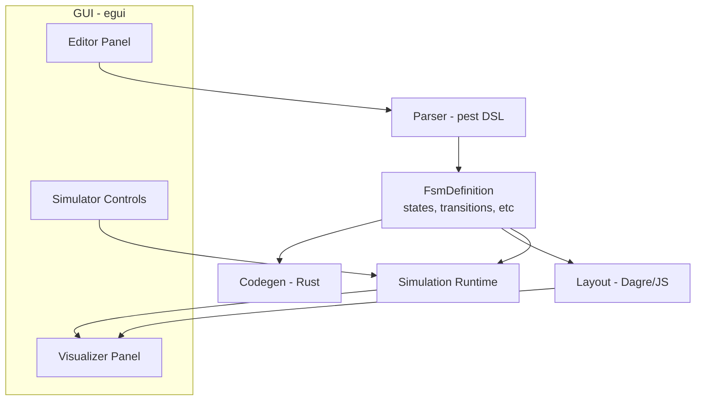

# Oxidate

**FSM Framework with GUI Visualization**

Oxidate is a Rust-based tool for designing, visualizing, and generating code from Finite State Machines (FSMs). It features a Mermaid-like DSL, an interactive GUI editor with simulation capabilities, and code generation for Standard Rust.


## GUI Demo

- Video: https://github.com/JoseClaudioSJr/Oxidate/blob/main/assets/gui-demo.mp4


---

## Features

- **Visual FSM Editor** — Interactive GUI built with egui/eframe
- **Mermaid-like DSL** — Familiar, readable syntax for defining state machines
- **Live Preview** — Real-time visualization as you type
- **Debug/Simulation Mode** — Step through states, fire events, watch transitions animate
- **Auto-layout** — Dagre-powered graph layout with orthogonal edge routing
- **Code Generation** — Export to Standard Rust
- **Timers & Choice Points** — First-class support for timeouts and conditional branching
- **Cross-platform** — macOS, Linux, Windows

### 🚀 Oxidate Pro

For embedded development, Oxidate Pro is available separately. Contact to purchase/access:

- https://github.com/JoseClaudioSJr/Oxidate/discussions
- https://github.com/JoseClaudioSJr/Oxidate/issues

- **Embassy** — Async Active Object pattern for embedded
- **RTIC** — Real-time event queues with priorities
- **Events with Payload** — Typed data with events
- **HSM** — Hierarchical State Machines

---

## Quick Start

### Prerequisites

- **Rust** 1.70+ (`rustup install stable`)
- **Node.js** 18+ (for Dagre layout engine)

### Installation

```bash
# Install from crates.io
# GUI app + CLI (default features)
cargo install oxidate-fsm

# CLI-only (no GUI deps)
cargo install oxidate-fsm --no-default-features

# Clone the repository
git clone https://github.com/JoseClaudioSJr/Oxidate.git
cd oxidate

# Install JS layout dependencies
cd tools/dagre-svg-demo && npm install && cd ../..

# Run the GUI
cargo run --release
```

### CLI Usage

```bash
# Parse and validate an FSM file
cargo run --bin oxidate-cli -- examples/traffic_light.fsm
```

---

## DSL Syntax

Oxidate uses a Mermaid-inspired DSL for defining FSMs:

```
fsm TrafficLight {
    // Initial state
    [*] --> Red

    // State definitions
    state Red: "Stop signal" {
        entry / turn_on_red()
        exit / turn_off_red()
    }
    
    state Yellow: "Caution signal"
    state Green: "Go signal"

    // Transitions
    Red --> Green : timer_expired
    Green --> Yellow : timer_expired
    Yellow --> Red : timer_expired
}
```

### States

```
// Simple state
state Idle

// State with description
state Running: "System is active"

// State with entry/exit actions
state Active {
    entry / initialize()
    exit / cleanup()
}
```

### Transitions

```
// Basic transition
StateA --> StateB

// Transition with event trigger
StateA --> StateB : button_press

// Transition with guard condition
StateA --> StateB : event [guard_condition]

// Transition with action
StateA --> StateB : event / do_something()

// Full syntax
StateA --> StateB : event [guard] / action()
```

### Timers

```
// Define a timer
timer blink_timer = 500 -> Tick periodic
timer timeout = 3000 -> Timeout

// Control timers in states
state Waiting {
    entry / start_timer(timeout)
    exit / stop_timer(timeout)
}
```

### Choice Points (Decision Nodes)

```
choice CheckCondition {
    [condition1] -> StateA / action1()
    [condition2] -> StateB
    [else] -> DefaultState
}

// Transition to choice point
StateX --> <<CheckCondition>> : evaluate
```

---

## GUI Features

### Editor Panel (Left)
- Syntax-highlighted DSL editor
- Real-time parsing with error feedback
- Load/Save FSM files

### Visualization Panel (Right)
- Interactive state diagram
- Pan and zoom
- Click states to select
- Animated transitions during simulation

### Toolbar
- **Layout Settings** — Direction (TB/LR), spacing
- **Code Generation** — Export to Rust (Standard/Embassy/RTIC)
- **Debug Mode** — Simulation controls

### Simulation Mode

1. Click **Debug** to enter simulation mode
2. Current state highlights in green
3. Available transitions show as buttons
4. Click an event to fire it and watch the transition animate
5. Use **Auto-run** for automatic event cycling

---

## Code Generation

Oxidate generates idiomatic Rust code for three targets:

### Standard Rust

From `examples/traffic_light.fsm`:

```rust
#[derive(Debug, Clone, Copy, PartialEq, Eq, Hash)]
pub enum TrafficLightState {
    Red,
    Yellow,
    Green,
}

#[derive(Debug, Clone, Copy, PartialEq, Eq, Hash)]
pub enum TrafficLightEvent {
    GreenExpired,
    RedExpired,
    YellowExpired,
}

/// Your code implements this; the machine calls into it.
pub trait TrafficLightActions {
    fn display_green(&mut self);
    fn display_red(&mut self);
    fn display_yellow(&mut self);
    fn start_timer(&mut self);
}

pub struct TrafficLight<T: TrafficLightActions> {
    state: TrafficLightState,
    context: T,
}

impl<T: TrafficLightActions> TrafficLight<T> {
    pub fn new(context: T) -> Self { /* ... */ }
    pub fn state(&self) -> TrafficLightState { self.state }

    /// Runs exit actions, the transition action, then entry actions.
    pub fn process(&mut self, event: TrafficLightEvent) { /* ... */ }
}
```

The generated code has no dependencies and no allocations — it is a plain enum
plus a `match`, so it drops into a `no_std` crate as-is.

### Programmatic Use (Library API)

Beyond the GUI and the CLI, `oxidate-fsm` can be used as a library, for example
from a `build.rs`:

```rust
use oxidate_fsm::{parse_fsm, generate_rust_code};

let source = std::fs::read_to_string("machine.fsm")?;

// One file may declare several machines, hence the Vec.
let fsms = parse_fsm(&source)?;

for fsm in &fsms {
    match generate_rust_code(fsm) {
        Ok(code) => std::fs::write(format!("{}.rs", fsm.name), code)?,
        Err(errors) => eprintln!("{}: {}", fsm.name, errors.join("; ")),
    }
}
```

`generate_rust_code` returns `Result<String, Vec<String>>`. The error case covers
definitions that would produce code that does not compile — a missing initial
state, a transition pointing at a state that was never declared, or two names
that collapse into the same Rust identifier (`idle_state` and `IdleState` both
become the variant `IdleState`).

To pick a backend explicitly:

```rust
use oxidate_fsm::codegen::{generate_rust_code_with_target, CodegenTarget};

let code = generate_rust_code_with_target(fsm, CodegenTarget::Standard)?;
```

### Embassy (Async Embedded)
- `#![no_std]` compatible
- Async state machine with `embassy_time::Timer`
- Suitable for Embassy executor

### RTIC
- `#![no_std]` compatible
- RTIC task structure
- Hardware abstraction layer hooks

---

## Project Structure

```
oxidate/
├── src/
│   ├── main.rs          # GUI application
│   ├── cli.rs           # Command-line interface
│   ├── lib.rs           # Library exports
│   ├── fsm/             # FSM data structures
│   │   └── mod.rs
│   ├── parser/          # DSL parser (pest)
│   │   ├── mod.rs
│   │   └── fsm.pest     # Grammar definition
│   └── codegen/         # Code generators
│       └── mod.rs
├── tools/
│   ├── dagre-svg-demo/  # Node.js Dagre layout backend
│   ├── gen_icon.py      # Icon generator
│   └── package/         # Packaging scripts
├── assets/
│   ├── oxidate.icns     # macOS icon
│   ├── oxidate.png      # PNG icon
│   └── linux/           # Linux desktop integration
├── docs/
│   └── RELEASING.md     # Release/packaging guide
└── Cargo.toml
```

---

## Architecture



### Layout Pipeline

The visualization uses a strict separation:

1. **FSM → Graph** — Convert states/transitions to graph nodes/edges
2. **Graph → Layout Engine** — Dagre (via Node.js subprocess) computes positions
3. **Layout → Renderer** — egui draws nodes and pre-computed edge routes

This ensures consistent, professional layouts without heuristic edge routing.

---

## Environment Variables

| Variable | Description |
|----------|-------------|
| `OXIDATE_DAGRE_DIR` | Override path to `tools/dagre-svg-demo` |
| `OXIDATE_NODE` | Override path to Node.js binary |

---

## Building & Packaging

See [docs/RELEASING.md](docs/RELEASING.md) for detailed packaging instructions.

### Quick Build

```bash
# Development
cargo run

# Release
cargo build --release

# macOS .app bundle
cargo bundle --release

# Linux .deb
cargo deb
```

---

## Contributing

Contributions are welcome! Please:

1. Fork the repository
2. Create a feature branch
3. Submit a pull request

---

## License

MIT License — see [LICENSE](LICENSE) for details.

---

## Acknowledgments

- [egui](https://github.com/emilk/egui) — Immediate mode GUI
- [pest](https://pest.rs/) — Parser generator
- [Dagre](https://github.com/dagrejs/dagre) — Graph layout
- Inspired by [Mermaid](https://mermaid.js.org/) and [XState](https://xstate.js.org/)
